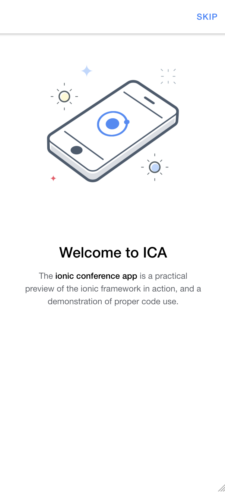

# Ionic E2E Example

This example app demonstrates how to build web and native end-to-end (E2E) tests with Ionic and Cordova or Capacitor. This example uses popular tools like [WebdriverIO](https://webdriver.io) and [Appium](https://appium.io) to enable cross-platform tests for iOS, Android, Web, and more.

Additionally, this example comes with some helpers that make it easier to write tests against Ionic or hybrid apps in general.

## About the Testing Stack

We've chosen WebdriverIO as the primary test runner and API for test authoring. WebdriverIO is the leading Node.js-based test automation framework and supports a wide variety of tools that support the WebDriver protocol.

WebdriverIO orchestrates tools like Appium and Chromedriver to actually run tests on target devices or a web browser.

One of the benefits of this stack compared to popular tools like [Cypress.io](https://cypress.io) is that it can test your actual native app, the same app that you'll ship to end users, but with a similar test authoring API.

## Exploring the Tests

Explore the [tests](https://github.com/ionic-team/ionic-e2e-example/tree/main/tests) folder to find a typical [Page Object Pattern](https://webdriver.io/docs/pageobjects/) test layout. In the `pageobjects` folder we find a typescript file corresponding to every logical page in our app. A Page Object is a testing abstraction over a page that defines properties and methods that we will interact with in our test specs.

For example, see the [Tutorial](https://github.com/ionic-team/ionic-e2e-example/blob/main/tests/pageobjects/tutorial.page.ts) Page Object, which defines the `slides`, `skipButton`, and `continueButton` properties corresponding to elements on the page that we will interact with in our test specs. Additionally, we define the `swipeLeft()`, `swipeRight()`, `skip()`, and `continue()` methods which are actions we will take against the page in our test specs.

  

In the `specs` folder we find test specs corresponding to each page, and this is where our actual test assertions live. Let's explore the [Tutorial Test Spec](https://github.com/ionic-team/ionic-e2e-example/blob/main/tests/specs/app.tutorial.spec.ts) to see the actual tests performed against the Tutorial Page Object.

## Test Helpers
